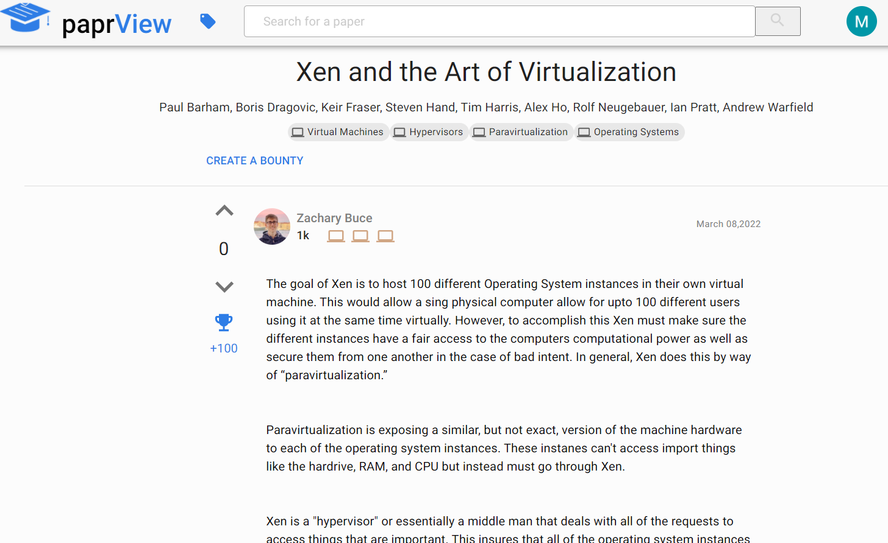

<div id="top"></div>

<!-- PROJECT LOGO -->
<br />
<div align="center">
  <a href="https://github.com/zacharybuce/paprView">
    
  </a>

  <h3 align="center">paprView</h3>

  <p align="center">
    A website that helps you find summaries from other users that are concise and easy to understand
    <br />
    <a href="https://paprview.com">Website</a>
    ·
    <a href="https://docs.google.com/forms/d/e/1FAIpQLSfWM_llRZj0k0_BDKhCM_GrcNOaRcfszVWsyYSM8MXWl2DdzQ/viewform">Give Feedback</a>
  </p>
</div>


<!-- TABLE OF CONTENTS -->
<details>
  <summary>Table of Contents</summary>
  <ol>
    <li>
      <a href="#about-the-project">About The Project</a>
      <ul>
        <li><a href="#built-with">Built With</a></li>
      </ul>
    </li>
    <li>
      <a href="#getting-started">Getting Started</a>
      <ul>
        <li><a href="#prerequisites">Prerequisites</a></li>
        <li><a href="#installation">Installation</a></li>
      </ul>
    </li>
    <li><a href="#features">Usage</a></li>
    <li><a href="#contact">Contact</a></li>
    <li><a href="#acknowledgments">Acknowledgments</a></li>
  </ol>
</details>


<!-- ABOUT THE PROJECT -->
## About The Project

The paprView website allows people to exchange their knowledge of subjects
through summarizing and discussing academic papers. The goal is to bring clarity to
all papers and foster a discussion around topics that were once only reserved for leading
researchers. This is accomplished with a community-driven system that allows users to gain
more Credibility and Points by posting summaries about academic papers.

This software provide an easy to use platform that facilitates the sharing of knowldege by allowing users to convinently create summaries and search for those summaries by paper. The platform allows user feedback on summaries through an upvote and downvote system. The more upvotes your summaries gain, the more points and credibilty you will recieve as well. This gives the platform a unique ability to destinguish misinformation by allowing users to see the credibility of the summary writer. Our Bounty system also allows users to put those points to use by assigning bounties to a paper. This will entice other users to write summaries on the paper, creating a user driven economy based on the sharing of information.

<div align="center"></div>

<p align="right">(<a href="#top">back to top</a>)</p>


### Built With

* [Next.js](https://nextjs.org/)
* [MongoDB](https://www.mongodb.com/)
* [MaterialUI](https://github.com/mui/material-ui)
* [Braft-Editor](https://github.com/margox/braft-editor)

Hosted on: [Vercel](https://vercel.com/)

<p align="right">(<a href="#top">back to top</a>)</p>


<!-- GETTING STARTED -->
## Getting Started

To get a local copy up and running follow the steps bellow.

### Prerequisites

You must have node intstalled along with npm or a package manager of your choice.

### Installation

1. Clone the repo
   ```sh
   git clone https://github.com/zacharybuce/paprView.git
   ```
2. Install NPM packages
   ```sh
   npm install
   ```
3. Setup a [mongodb](https://www.mongodb.com/) database as well as [google oauth](https://developers.google.com/identity/protocols/oauth2). This step is required. 
4. Create a .env.local file.
   ```txt
   MONGO_URI=<your mongo uri>
   NEXT_PUBLIC_ROOT_URL="http://localhost:3000"
   GOOGLE_CLIENT_ID=<Google client id>
   GOOGLE_CLIENT_SECRET=<Google client secret> 
   ```

<p align="right">(<a href="#top">back to top</a>)</p>


<!-- USAGE EXAMPLES -->
## Features
* Creation of summaries that are associated with an academic paper.
* Summary writing tool through Braft-Editor.
* Tag system for the academic papers.
* Paper search functionality using mongoDB Atlas.
* Filter options for search results including tag and publish date. 
* Search for paper by tag.
* Profile creation through Google OAuth.
* Profile dashboard to view user info(tags,credibility, summaries, etc.)
* Upvote and Downvote system.
* Credibility system that shows a user's expertise in a certain tag.
* Point system that allows users to spend on bounties.
* Bounty system that allows for users to insentivize other users to summarize a paper.
* Allows users to change their name.

[More about paprView](https://paprview.com/help)

<p align="right">(<a href="#top">back to top</a>)</p>

<!-- CONTACT -->
## Contact

Linkedin - [Zachary Buce](https://www.linkedin.com/in/zacharybuce/)

Project Link: [https://github.com/zacharybuce/paprView](https://github.com/zacharybuce/paprView)

<p align="right">(<a href="#top">back to top</a>)</p>

<!-- ACKNOWLEDGMENTS -->
## Acknowledgments

Dr. Wu Hao for being my advisor through this project.
<br/>
Michael Whitford for collecting user responses to the site.

<p align="right">(<a href="#top">back to top</a>)</p>
